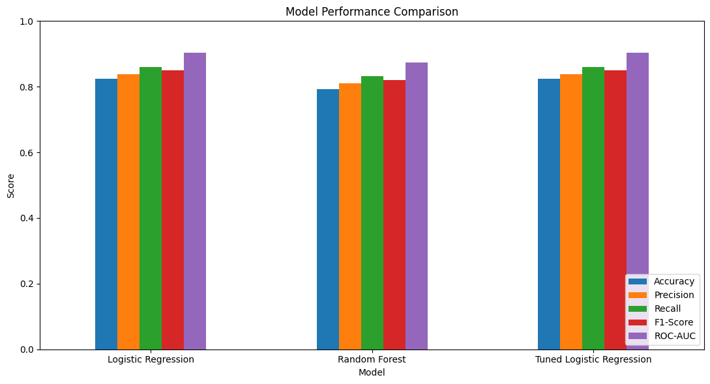
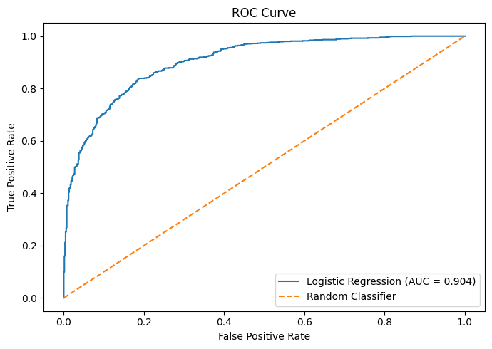
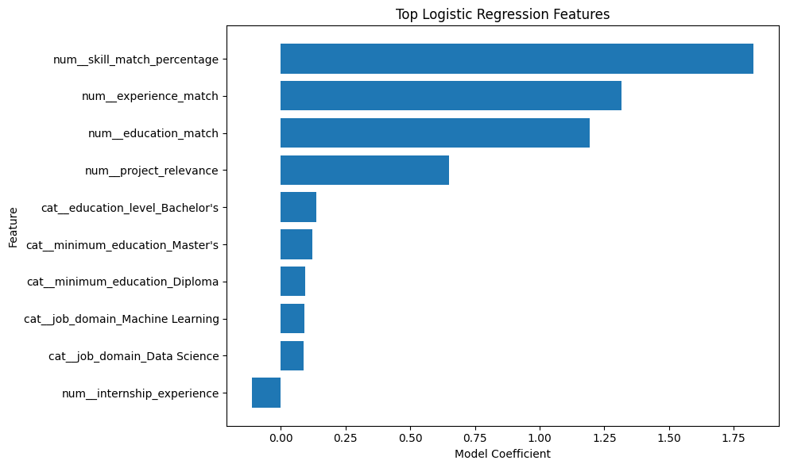

# CareerMatch ML

## Candidate–Job Compatibility Prediction Using Classical Machine Learning

CareerMatch ML is an end-to-end classical machine learning project that predicts candidate–job compatibility from structured candidate and job attributes.

## Problem Statement

This project formulates candidate–job compatibility as a binary classification problem:

- `0` = Low Compatibility
- `1` = High Compatibility

## Machine Learning Workflow

```text
Candidate + Job Data
        ↓
Data Cleaning
        ↓
Exploratory Data Analysis
        ↓
Feature Engineering
        ↓
Train/Test Split
        ↓
Preprocessing
        ↓
Logistic Regression
        ↓
Random Forest Comparison
        ↓
Cross-Validation
        ↓
Hyperparameter Tuning
        ↓
Model Evaluation
        ↓
Feature Interpretation
        ↓
Compatibility Prediction
```

## Dataset
The project contains 8,000 candidate–job application records with candidate attributes, job requirements, and engineered compatibility features.
Candidate Features
- Education level
- Years of experience
- Python
- SQL
- Machine Learning
- Deep Learning
- Power BI
- Excel
- Cloud
- Certification count
- Project count
- Internship experience
## Job Features
- Job domain
- Required experience
- Required Python
- Required SQL
- Required Machine Learning
- Required Deep Learning
- Required Power BI
- Required Excel
- Required Cloud
- Minimum education
## Engineered Features
The project derives compatibility-oriented features including:
- Skill match percentage
- Experience match
- Education match
- Project relevance
## Exploratory Data Analysis
The project performs exploratory analysis before model training, including:
- Dataset structure and data types
- Missing-value analysis
- Duplicate-row analysis
- Target distribution
- Feature statistics
- Correlation analysis
- Compatibility distribution
The dataset contains no missing values.
## Feature Engineering
Feature engineering converts raw candidate and job attributes into model-ready features.
Examples include:
- Matching candidate skills against job requirements
- Calculating skill match percentage
- Measuring experience alignment
- Measuring education compatibility
- Estimating project relevance
Categorical features are encoded and numerical features are prepared for machine learning.
## Models
1. Logistic Regression
Used as the primary interpretable baseline classification model.
Logistic Regression provides both:
- Binary predictions
- Probability estimates
It also allows model coefficients to be analyzed to understand feature contributions.
2. Random Forest
A Random Forest classifier was trained as a nonlinear comparison model.
This allows the project to compare two different classical machine learning approaches.
3. Tuned Logistic Regression
GridSearchCV with 5-fold cross-validation was used to search for better Logistic Regression hyperparameters.
Best parameters:
C = 1
solver = liblinear

## Model Evaluation
The models were evaluated using:
- Accuracy
- Precision
- Recall
- F1-score
- ROC-AUC
- Confusion Matrix
- ROC Curve
- Cross-validation

### Model Performance Comparison



## Logistic Regression Results
Metric	Score
Accuracy	82.46%
Precision	83.84%
Recall	86.00%
F1-Score	84.91%
ROC-AUC	90.44%


## Random Forest Results
Metric	Score
Accuracy	79.18%
Precision	81.03%
Recall	83.20%
F1-Score	82.10%
ROC-AUC	87.35%


## Final Model Comparison
Model	Accuracy	F1-Score	ROC-AUC
Logistic Regression	82.46%	84.91%	90.44%
Random Forest	79.18%	82.10%	87.35%
Tuned Logistic Regression	82.46%	84.91%	90.44%


Hyperparameter tuning selected:
C = 1
solver = liblinear

The tuned model produced the same held-out test metrics as the baseline configuration, indicating that the baseline configuration was already close to the best configuration evaluated.
## Confusion Matrix
The final Logistic Regression model produced:
[[515 148]
 [125 768]]

This provides a detailed view of:
- True negatives
- False positives
- False negatives
- True positives

## ROC-AUC
The Logistic Regression model achieved:
ROC-AUC = 0.9044

The ROC curve is included in the notebook to visualize the model's ability to distinguish between low- and high-compatibility applications.

### ROC Curve



## Model Interpretation
Logistic Regression coefficients were analyzed to understand which engineered features contributed most strongly to predictions.
Important positive contributors included:
- Skill match percentage
- Experience match
- Education match
- Project relevance
This makes the model more interpretable compared with treating the prediction system as a complete black box.
### Top Logistic Regression Features



## Example Prediction
The project contains a reusable prediction function that accepts candidate and job information.
Example output:
Compatibility probability: 99.80%
Prediction: High Compatibility

The probability represents the model's estimated compatibility probability for the supplied synthetic candidate-job pair.
## Project Structure
```text
CareerMatch-ML/
│
├── data/
│   └── candidate_job_compatibility.csv
│
├── models/
│   └── careermatch_model.pkl
│
├── notebooks/
│   └── CareerMatch_ML.ipynb
│
├── src/
│   └── predict.py
│
├── results/
│   ├── model_comparison.png
│   ├── roc_curve.png
│   └── feature_importance.png
│
├── README.md
├── requirements.txt
└── .gitignore
```

## Technologies
- Python
- Pandas
- NumPy
- Scikit-learn
- Matplotlib
- Seaborn
- Joblib
- Google Colab
- GitHub
## Core Machine Learning Concepts Demonstrated
- Supervised learning
- Binary classification
- Exploratory data analysis
- Feature engineering
- Train/test splitting
- Stratified sampling
- Categorical encoding
- Numerical preprocessing
- Logistic Regression
- Random Forest
- Probability prediction
- Cross-validation
- GridSearchCV
- Hyperparameter tuning
- Accuracy
- Precision
- Recall
- F1-score
- ROC-AUC
- Confusion matrix
- ROC curve
- Model interpretation
## Limitations
This project uses a synthetically generated dataset designed for educational and portfolio demonstration purposes.
The compatibility labels simulate candidate–job compatibility and do not represent actual employer hiring decisions.
Therefore:
- The reported metrics should not be interpreted as real-world recruitment accuracy.
- The model should not be used to make actual employment decisions.
- Real-world deployment would require validated data, privacy protection, fairness analysis, domain validation, and additional testing.
## Future Improvements
Potential extensions include:
- Resume and job-description NLP
- Semantic skill matching
- Embedding-based similarity
- SHAP-based explainability
- Streamlit deployment
- Candidate–job ranking
- Fairness and bias analysis
- Model monitoring
- Real-world anonymized datasets
